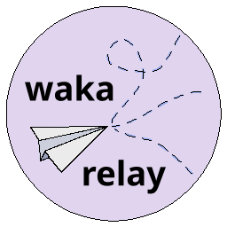

<div align="center">

  

  <span style="font-size: 1.3rem;">A self-hosted app that relays WakaTime heartbeats to multiple instances</span>

  <p>
    
    
    
    
  </p>

  <h3>
    <a href="#features">Features</a>
    <span> | </span>
    <a href="#installation">Installation</a>
    <span> | </span>
    <a href="https://github.com/ImShyMike/waka-relay/issues">Issues</a>
  </h3>
  
</div>

## Installation

Start by cloning the repo:

```bash
$ git clone https://github.com/ImShyMike/waka-relay.git
```

Then follow any of the following instructions:

### Quick run

```bash
# Run the app using python
$ python relay/main.py

# Or use uvicorn directly (WARNING: this will ignore the host, port, and worker configuration)
$ uvicorn relay.main:app
```

### Using docker

```bash
# First start by building the package
$ docker build -t waka-relay .

# Then run the container
$ docker run -d \
  -p 25892:25892 \
  -v ~/.waka-relay.toml:/root/.waka-relay.toml \
  --name waka-relay \
  waka-relay
```

## Features

* ✅ Multi-instance support
* ✅ Self-hosted
* ✅ Key authentication
* ✅ Highly configurable
* ✅ Fully relays WakaTime requests

## Example config

```toml
[relay]
workers = 2
timeout = 10
require_api_key = true
api_key = "39949664-5a5f-4c7d-95b2-44a864f67b6a"
debug = false

[relay.instances]
"https://api.wakatime.com/api/v1" = "WAKATIME API KEY"
```

For a full config example with an explanation check out the [example config file](.waka-relay.toml).

## Configuration options

| TOML key | Default value | Description |
|----------|---------------|-------------|
|`host`|`"0.0.0.0"`|Host for the webserver to listen on|
|`port`|`25892`|Port for the webserver to run on|
|`workers`|`4`|Worker count for the webserver|
|`timeout`|`25`|Timeout value for the relayed requests (in seconds)|
|`time_text`|`"%TEXT% (Relayed)"`|Text to display in the IDE (%TEXT% is replaced by what the api retuns)|
|`require_api_key`|`""`|Whether or not to require an API key|
|`api_key`|`""`|The API key to use if `require_api_key` is true|
|`debug`|`false`|Whether or not to enable debug logging|
